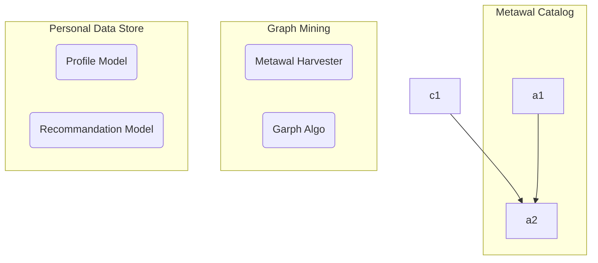
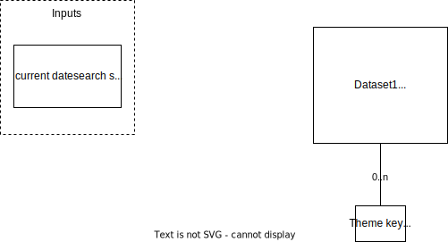
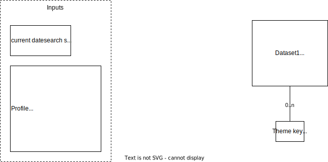

# Metawal-IA

## Architecture




## Modèle objet

Les sources commentées du modèle objet sont dans [./models/](./models).


## Sample data

Données obtenues avec  
https://metawal4.test.wallonie.be/geonetwork/srv/eng/csw?SERVICE=CSW&VERSION=2.0.2&resultType=results&elementSetName=full&typenames=csw:Record&REQUEST=GetRecords&outputSchema=http://www.w3.org/ns/dcat%23&maxRecords=200


REST API call in DCAT:
https://metawal4.test.wallonie.be/geonetwork/api/collections/main/items?f=dcat&limit=100 

CSW all records in DCAT :
https://metawal.wallonie.be/geonetwork/srv/eng/csw?SERVICE=CSW&VERSION=2.0.2&REQUEST=GetRecords&outputSchema=http://www.w3.org/ns/dcat%23&typenames=csw:Record&elementSetName=full&resultType=results&maxRecords=2000


## Paths of interest

### Based on previous datasets of interest
 - same themes : `(A)-[:dcat:theme]-(theme)-[:dcat:theme]-(B)`
 - same service ?
 - same keywords ?
 - newer version
 - same publisher (`dct:publisher`)
 - same serie
 - apps serving the above

Order by newest

### Related to found datasets

 - 

## Cypher queries

Return all datasets and their relationships (better limit this) :
```
GRAPH.QUERY metawal "MATCH (s:`dcat:Dataset`)-[p]->(o) RETURN s,p,o LIMIT 5"
```

Return all datasets and their themes :
```
GRAPH.QUERY metawal "MATCH (s:`dcat:Dataset`)-[p:`dcat:theme`]->(o) RETURN s,p,o"
```

Return all datasets and their distributions :
```
GRAPH.QUERY metawal "MATCH (s:`dcat:Dataset`)-[p:`dcat:theme`]->(o) RETURN s,p,o"
```

Return all existing formats and their number :
```
GRAPH.QUERY metawal "MATCH (d:`dcat:Distribution`) RETURN distinct d.`http://purl.org/dc/terms/format`, COUNT (d.`http://purl.org/dc/terms/format`)"
```


Create index on keywords (when indexes will support arrays) : 
```
GRAPH.QUERY metawal "CALL db.idx.fulltext.createNodeIndex('dcat:Dataset', 'http://www.w3.org/ns/dcat#keyword')"
```

Create index on keywords (using an ad-hoc aggregated field) :
```
GRAPH.QUERY metawal "CALL db.idx.fulltext.createNodeIndex('dcat:Dataset', 'FTkeywords')"
```


Search concepts by text and find related datasets :
```
GRAPH.QUERY metawal "CALL db.idx.fulltext.queryNodes('skos:Concept', 'hydro*') YIELD node as Concept MATCH (dataset) -[p:`dcat:theme`]-> (Concept) RETURN dataset.`http://purl.org/dc/terms/title`"
```

## Calcul du score


### Path-based score vs Target-based score
**Target-based score** : un coefficient de score est intrinsèque à la cible (un dataset)
E.g. : date de mise à jour

**Path-based score** : un coefficient de score est calculé sur base du chemin parcouru pour parvenir à la cible 

## Scenarios

### Utilisateur lambda anonyme - pas d'historique, pas de termes de recherche



### Utilisateur connecté - historique, pas de termes de recherche



