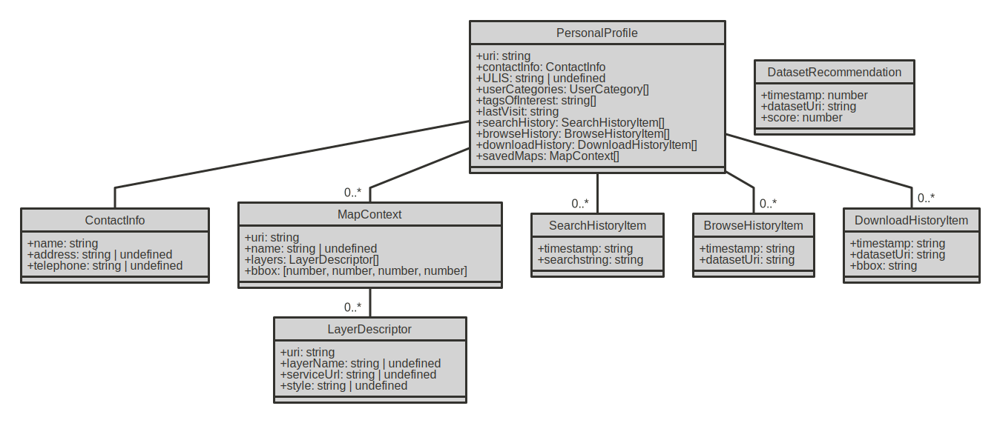

# Metawal-IA

## Architecture


## Modèle objet

Les sources commentées du modèle objet sont dans [./models/](./models).



## Sample data

Données obtenues avec  
https://metawal4.test.wallonie.be/geonetwork/srv/eng/csw?SERVICE=CSW&VERSION=2.0.2&resultType=results&elementSetName=full&typenames=csw:Record&REQUEST=GetRecords&outputSchema=http://www.w3.org/ns/dcat%23&maxRecords=200


REST API call in DCAT:
https://metawal4.test.wallonie.be/geonetwork/api/collections/main/items?f=dcat&limit=100 

CSW all records in DCAT :
https://metawal.wallonie.be/geonetwork/srv/eng/csw?SERVICE=CSW&VERSION=2.0.2&REQUEST=GetRecords&outputSchema=http://www.w3.org/ns/dcat%23&typenames=csw:Record&elementSetName=full&resultType=results&maxRecords=2000


## Types of Catalog Data

### General remarks

CSW DCAT :
- multi-identifier concatenated

REST DCAT : 
 - all keywords are encoded as skos:Concept
 - actual skos:Concept have no declaration of scheme

### Dataset

https://metawal.wallonie.be/geonetwork/srv/fre/catalog.search#/metadata/7db130d2-25b1-4a7f-b427-6b2463ae6633

CSW DCAT :
- encoded as `dcat:Dataset`
- parent/children rels encoded as `dct:relation` (with no further typing)
- other associated resources as `dct:relation`

REST DCAT :
- encoded as `dcat:Dataset`
- no parent/children rels


### Serie

https://metawal.wallonie.be/geonetwork/srv/fre/catalog.search#/metadata/a5577b78-a388-48e7-86f9-c3138d562270

CSW DCAT : 
 - no clear 'Serie' attribute, encoded as `rdf:Description`

REST DCAT :
 - no clear 'Serie' attribute, encoded as `dcat:Dataset`

### Service

https://metawal.wallonie.be/geonetwork/srv/fre/catalog.search#/metadata/4bef2af5-422a-45b0-9e9a-fa692fb0f18c

CSW DCAT :
- no clear 'Service' attribute, encoded as `rdf:Description`
- no relations between service and sources

REST DCAT :
- encoded as `dcat:DataService` , and `dct:type -> DataService`
- no relations between service and sources


### Application

https://metawal.wallonie.be/geonetwork/srv/fre/catalog.search#/metadata/986366ec-7dc3-4c80-8e52-44de19ddd198

CSW DCAT :
- no clear 'Service' attribute, encoded as `rdf:Description`

REST DCAT :
- encoded as `dcat:Dataset` , but `dct:type -> DataService`


## Paths of interest

### Based on previous datasets of interest
 - same themes : `(A)-[:dcat:theme]-(theme)-[:dcat:theme]-(B)`
 - same service ?
 - same keywords ?
 - newer version
 - same publisher (`dct:publisher`)
 - same serie
 - apps serving the above

Order by newest

### Related to found datasets

 - 

## Cypher queries

Return all datasets and their relationships (better limit this) :
```
MATCH (s:`dcat:Dataset`)-[p]->(o) RETURN s,p,o LIMIT 5
```

Return all datasets and their themes :
```
MATCH (s:`dcat:Dataset`)-[p:`dcat:theme`]->(o) RETURN s,p,o
```

Return all datasets and their distributions :
```
MATCH (s:`dcat:Dataset`)-[p:`dcat:theme`]->(o) RETURN s,p,o
```

Return all existing formats and their number :
```
MATCH (d:`dcat:Distribution`) RETURN distinct d.`http://purl.org/dc/terms/format`, COUNT (d.`http://purl.org/dc/terms/format`)
```


Create index on keywords (when indexes will support arrays) : 
```
CALL db.idx.fulltext.createNodeIndex('dcat:Dataset', 'http://www.w3.org/ns/dcat#keyword')
```

Create index on keywords (using an ad-hoc aggregated field) :
```
CALL db.idx.fulltext.createNodeIndex('dcat:Dataset', 'FTkeywords')
```


Search concepts by text and find related datasets :
```
CALL db.idx.fulltext.queryNodes('skos:Concept', 'hydro*') YIELD node as Concept MATCH (dataset) -[p:`dcat:theme`]-> (Concept) RETURN dataset.`http://purl.org/dc/terms/title`
```


Search relations :
```
MATCH (node)-[p:`dct:relation`]->(o) RETURN node,p,o LIMIT 50
```


Search all resources matching a concept, then return these nodes with some of thieir properties :
```
CALL db.idx.fulltext.queryNodes('skos:Concept', 'industrie') YIELD node as tag MATCH (res)-[:`dcat:theme`]->(tag),(res)-[p:`dcat:theme`]-(obj) RETURN res,p,obj LIMIT 500
```


Combine full text searches on tag and Datasets, atttributing different scores and summing the scores
```
GRAPH.QUERY metawal "
    CALL db.idx.fulltext.queryNodes('skos:Concept', 'industrie') YIELD node as tag
    MATCH (res1:`dcat:Dataset`)-[:`dcat:theme`]->(tag)
    WITH COLLECT({res: res1, score: 2}) as conceptMatches
    CALL db.idx.fulltext.queryNodes('dcat:Resource', 'industrie') YIELD node as res2
    MATCH (res2:`dcat:Dataset`)
    WITH conceptMatches, COLLECT({res: res2, score: 5}) as textMatches
    WITH conceptMatches + textMatches as allMatches
    UNWIND allMatches as match
    RETURN DISTINCT match.res.uri, match.res.`http://purl.org/dc/terms/title`, COUNT(match.res.uri) as test, SUM(match.score) as score ORDER BY score
```


## Calcul du score

### Full Text match


### Path-based score vs Target-based score
**Target-based score** : un coefficient de score est intrinsèque à la cible (un dataset)
E.g. : date de mise à jour

**Path-based score** : un coefficient de score est calculé sur base du chemin parcouru pour parvenir à la cible 

## Scenarios

### Utilisateur lambda anonyme - pas d'historique, pas de termes de recherche


### Utilisateur connecté - historique, pas de termes de recherche


